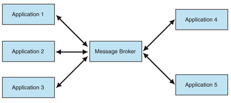

# Lab 1 Message broker

## Intro

Message broker is a distributed system which allows asynchronous communication
between multiple servers.

## Asynchronous communication

Asynchronous communication means that if ServerA wants to send a message
to ServerB it shouldn't imply ServerB to be up and running. Moreover, message broker allows
concurrent processing of request. 

## Technologies 

Python 3, asyncio, TinyDB

## How to run?

1. Clone the repo
2. Navigate to src/ folder
3. Run Message Broker: `python3 MessageBroker.py`
4. Run Sender: `python3 Sender.py`
5. Run Receiver: `python3 Receiver.py`

## Features

1. Adding messages concurrently to queue.
2. Consuming messages concurrently from queue.
3. Serialization of the queue.
4. Storing messages in DB.
5. Restoring messages from DB.
6. Routing of messages based on the topic.
7. Dynamic queues.
8. Error tolerance.
9. Backward compatibility with client which don't have a topic. 
10. Persistent and non-persistent queues.

